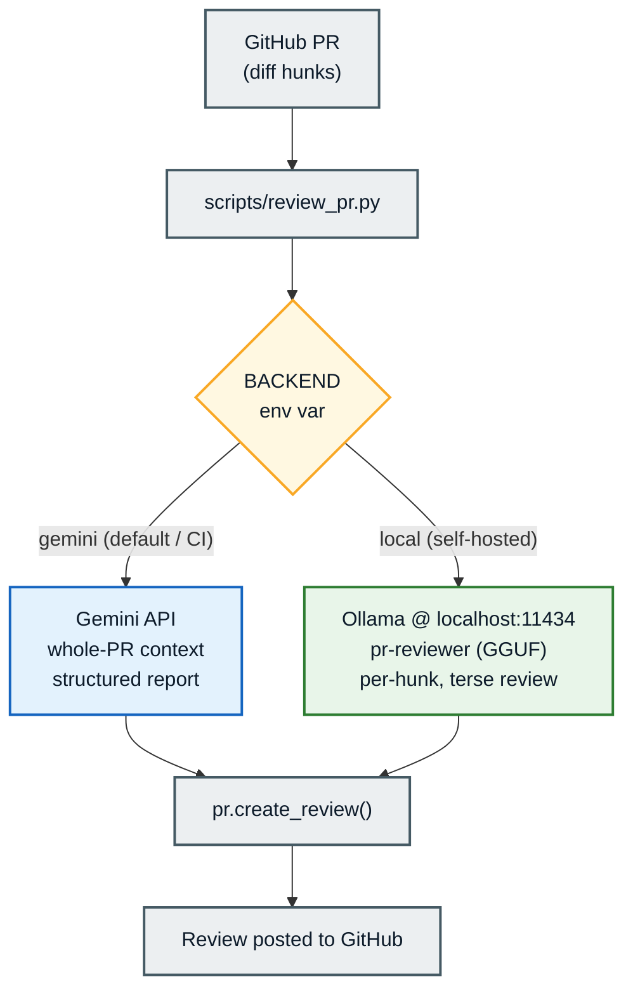
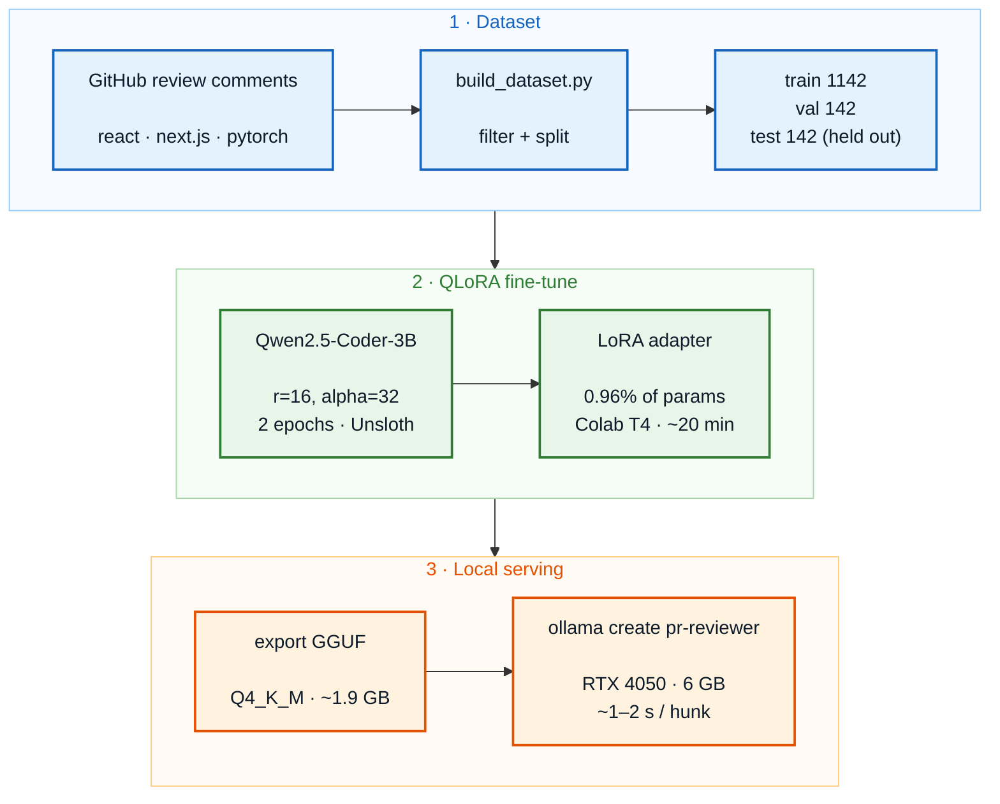

# PR-Reviewer: A QLoRA Fine-Tuned, Self-Hosted Code Review Model

A 3B open-weight model, fine-tuned with QLoRA on real GitHub PR review comments,
served locally with Ollama, and plugged into a GitHub PR bot as a free
alternative to the Gemini API.

The aim was not to beat a frontier model. It was to measure how far a small,
local, fine-tuned model gets on a narrow task, tested against both an untuned
baseline and a frontier API.

---

## TL;DR

- Fine-tuned `Qwen2.5-Coder-3B-Instruct` with QLoRA on ~1,142 PR review comments.
- 2 epochs, 286 steps, 0.96% of params trained. Loss went down, no overfitting.
- Exported to GGUF, runs on a 6 GB laptop GPU via Ollama at $0 per review.
- Added to a GitHub PR bot with a `BACKEND=local` switch (the API path is unchanged).
- Tested tuned vs. base vs. Gemini on a held-out set with ROUGE/BLEU and a local
  LLM-judge. Result: fine-tuning changed the output style (BLEU 1.41 → 2.38), but
  judge scores were within noise of the baseline at this sample size.

---

## Architecture

### Bot routing



### Training & serving pipeline



---

## The dataset

Source: the GitHub review-comments API
(`GET /repos/{owner}/{repo}/pulls/comments`). Each comment gives a `diff_hunk`
(the code) and a `body` (the reviewer's note) — an input/output pair for
fine-tuning.

Repos used: `facebook/react`, `vercel/next.js`, `pytorch/pytorch`.

The raw data was about half noise. Filters applied:

- Drop thread replies (`in_reply_to_id` set). These depend on earlier context
  the model can't see. Biggest single improvement.
- Drop bot comments and short acknowledgements (`LGTM`, `done`, `thanks`).
- Keep comment body 20–400 chars, diff hunk under 1500 chars.
- Deduplicate; cap each repo at 600 rows.

| Split | Rows |
|-------|------|
| train | 1142 |
| val   | 142  |
| test  | 142 (held out, never trained on) |

---

## Training

| Setting | Value |
|---|---|
| Base model | `unsloth/Qwen2.5-Coder-3B-Instruct` |
| Method | QLoRA (4-bit) via Unsloth |
| LoRA rank / alpha | 16 / 32 |
| Target modules | q, k, v, o, gate, up, down proj |
| Epochs | 2 (286 steps) |
| Batch / grad-accum | 2 × 4 (effective 8) |
| Learning rate | 2e-4, linear |
| Hardware | Google Colab T4 (~20 min) |
| Trainable params | 29.9M / 3.12B (0.96%) |

Data was formatted with Qwen2.5's chat template (system prompt + diff + comment).
Loss over training:

| Step | Training loss | Validation loss |
|------|---------------|-----------------|
| 50   | 1.476         | 1.437           |
| 100  | 1.458         | 1.391           |
| 150  | 1.310         | 1.364           |
| 200  | 1.223         | 1.353           |
| 250  | 1.231         | 1.345           |

Validation loss dropped through both epochs, so the model did not overfit.

---

## Serving

The adapter was exported to GGUF (`Q4_K_M`, ~1.9 GB) and loaded into Ollama with
the system prompt baked in:

```
FROM ./gguf/qwen2.5-coder-3b-instruct.Q4_K_M.gguf
SYSTEM "You are a senior code reviewer. Given a code diff, write ONE concise,
        actionable review comment about the most important issue."
PARAMETER temperature 0.2
PARAMETER num_predict 100
PARAMETER repeat_penalty 1.2
```

```bash
ollama create pr-reviewer -f Modelfile
ollama run pr-reviewer
```

Runs on a 6 GB GPU, ~1–2 seconds per hunk.

Example on a held-out diff. Given a query built by string concatenation, the
model returns a parameterized fix:

> ```suggestion
> from sqlalchemy import text
> def get_user(id):
>     return db.query(text("SELECT * FROM users WHERE id = :id"), {"id": id})
> ```

---

## The PR bot

`scripts/review_pr.py` has two backends, picked by the `BACKEND` env var:

```bash
# Gemini (default; used by the GitHub Action)
REPO_NAME=owner/repo PR_NUMBER=6 python scripts/review_pr.py

# Local fine-tuned model (free, self-hosted)
BACKEND=local REPO_NAME=owner/repo PR_NUMBER=6 python scripts/review_pr.py
```

Both post a review to the PR. The local backend reviews one diff hunk at a time
(how the model was trained). The Gemini backend sends the whole PR with full-file
context.

Note: local mode only works for self-hosted runs. The GitHub Action runs on
GitHub's servers and can't reach `localhost:11434`, so CI uses the API backend.

---

## Evaluation

Three models, tested on the held-out set:

- base — `qwen2.5-coder:3b`, untuned (same model and size, no fine-tuning)
- tuned — the fine-tuned `pr-reviewer`
- gemini — `gemini-2.5-flash`, the frontier reference

Metrics:

- ROUGE-L / BLEU: text overlap with the human comment.
- LLM-judge (1–5): a separate model (`qwen2.5:7b`, run locally) rates each
  review against the diff and the human comment. Local for reproducibility and
  no rate limits.

| Model | ROUGE-L | BLEU | Judge (1–5) | Latency/req | Cost |
|-------|---------|------|-------------|-------------|------|
| base   | 0.099 | 1.41 | 3.2 | local | $0 |
| tuned  | 0.090 | 2.38 | 2.9 | ~1–2s | $0 |
| gemini | 0.061 | 0.00 | 2.9 | API   | API cost |

*(Judge over 20 rows; ROUGE/BLEU over the held-out set.)*

### Reading the results

ROUGE/BLEU don't work well here. All three score ~0.06–0.10 ROUGE-L because a
correct review can be worded many ways — "this is a SQL injection" and
"parameterize this query" are both right but share few words. Gemini's BLEU of
0.00 is because its output (long reports) looks nothing like the short human
comment, not because it's wrong. These metrics can't separate the models.

On the judge, the three scores (3.2 / 2.9 / 2.9 over 20 rows) are too close to
call. A few `1`s move a 20-row average by ~0.15, so the 0.3 gap between base and
tuned is within noise. The takeaway: automatic scoring of free-form review is
hard, and 20 rows is too small to detect small differences.

What did change: BLEU went from 1.41 (base) to 2.38 (tuned), so the tuned model
picked up more of the reviewers' wording. It also writes short, direct comments
instead of the base model's longer, hedging ones. Fine-tuning moved style and
format, which is what it's for. Deep, codebase-specific reasoning stays a
frontier-model strength.

---

## Limitations

- Trained on small single-hunk diffs. On large multi-function patches it tends
  to repeat the code instead of reviewing it. Best for per-hunk triage, not
  whole-PR audits.
- Variance: on the same diff it sometimes gives the right fix and sometimes a
  plausible but wrong one. A first pass, not a replacement for human review.
- Small eval set (20–60 judged rows). Treat judge numbers as directional.

## Where each model fits

- Local 3B: fast, free, private first-pass triage on small PRs. Catches common
  issues (injection, missing guards, resource leaks) at no cost.
- Gemini: full, structured audits with whole-PR context and stronger reasoning,
  at API cost and latency. Better for a final review.

The `BACKEND` switch lets you pick per run.

---

## Repo layout

```
scripts/review_pr.py        # PR bot: Gemini + local backends
prompts/system_prompt.txt   # reviewer prompt (Gemini backend)
finetune/
  data/build_dataset.py     # mine + filter GitHub review comments
  data/{train,val,test}.jsonl
  src/evaluate.py           # base vs tuned vs Gemini; ROUGE/BLEU + local judge
  src/score_local.py        # local-only ROUGE/BLEU
  Modelfile                 # Ollama model definition
  gguf/                     # exported GGUF (gitignored)
  adapters/                 # LoRA adapter (gitignored)
  results/
    comparison.md           # eval table
    eval_scores.json
```

## Reproduce

```bash
# 1. build dataset
cd finetune && python data/build_dataset.py        # needs GITHUB_TOKEN

# 2. train (Colab T4): QLoRA on Qwen2.5-Coder-3B, 2 epochs
#    then export adapter -> GGUF (Q4_K_M)

# 3. serve
ollama create pr-reviewer -f Modelfile

# 4. evaluate
set -a; source .env; set +a
python src/evaluate.py        # writes results/comparison.md

# 5. run the bot
BACKEND=local REPO_NAME=owner/repo PR_NUMBER=N python ../scripts/review_pr.py
```

## Stack

Qwen2.5-Coder-3B · QLoRA / Unsloth · PyTorch · GGUF / llama.cpp · Ollama ·
PyGithub · rouge-score · sacrebleu · Gemini API